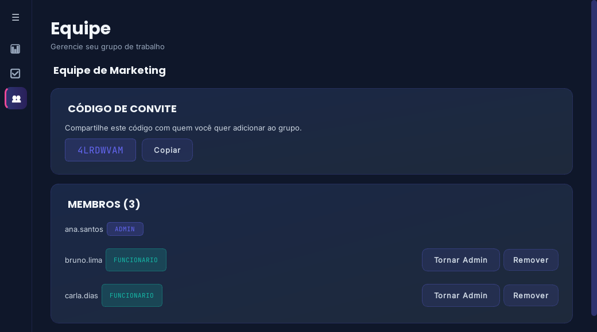

# 🖥️ Gestor de Tarefas Híbrido (Desktop + API)

[](https://github.com/RafaelSilvaWork/Gestor-de-Tarefas/actions/workflows/backend-tests.yml)

> Uma aplicação full-stack de arquitetura desacoplada, combinando uma interface gráfica desktop nativa desenvolvida em **PyQt5** com um backend em **FastAPI** e banco de dados relacional.

---

## 🚀 Sobre o Projeto

Este projeto faz parte do meu portfólio de desenvolvimento de software e demonstra a capacidade de criar soluções **híbridas**, onde a interface gráfica (GUI) roda localmente na máquina do usuário e se comunica via requisições HTTP REST, autenticadas por JWT, com uma API centralizada.

---

## ⬇️ Baixar e Testar (Windows)

Não precisa instalar Python nem clonar o repositório para testar. Baixe **`GestorDeTarefas.exe`** na [página de Releases](https://github.com/RafaelSilvaWork/Gestor-de-Tarefas/releases/latest) e dê dois cliques.

O backend (API) roda embutido no próprio processo do app — não existe mais um segundo executável para abrir. Na primeira execução, o app cria automaticamente um `.env` com uma chave secreta e o banco `tarefas.db` na mesma pasta do `.exe`. Se a porta 8000 já estiver em uso por outro programa (ou outra instância do app), uma mensagem de erro clara é exibida na própria interface, com detalhes técnicos disponíveis em "Show Details".

> O Windows SmartScreen pode alertar por ser um executável não assinado digitalmente ("Windows protegeu seu computador"). Clique em **Mais informações → Executar assim mesmo** — é esperado para binários gerados fora da Microsoft Store/lojas.

---

## 📸 Screenshots

| Painel | Tarefas |
|---|---|
|  |  |

| Equipe (visão do administrador) |
|---|
|  |

---

## ✨ Funcionalidades

- **Autenticação JWT** — registro e login, com senhas armazenadas via hash `bcrypt`.
- **Grupos de trabalho** — crie uma equipe (vira administrador) ou entre em uma existente com um código de convite (vira funcionário). O administrador atribui tarefas aos membros e acompanha todas as tarefas do grupo; cada funcionário só vê e gerencia as que foram atribuídas a ele. Quem não está em nenhum grupo continua no modo solo de sempre.
- **CRUD completo de tarefas** (criar, editar, concluir/reabrir, excluir) isolado por usuário ou por grupo.
- **Prazo e tags** por tarefa, com aviso visual quando está atrasada.
- **Cards de tarefa** com prioridade colorida, status e ações de editar/excluir, em vez de uma tabela genérica.
- **Modal de criar/editar tarefa**, com filtros por status e prioridade em pills.
- **Painel analítico** com gráfico de rosca e indicadores (total, concluídas, taxa de conclusão).
- **Navegação lateral colapsável** (menu ☰), separando Painel e Tarefas.
- **Notificações na bandeja do sistema** (`QSystemTrayIcon`) ao criar ou concluir uma tarefa.
- **Exportação de relatórios** do histórico de tarefas em **CSV** e **PDF** formatado.
- **Design system autoral** (índigo/magenta/teal sobre deep navy), com Poppins/Inter/JetBrains Mono embutidas e micro-interações (glow animado no hover dos cards).

---

## 🛠️ Tecnologias Utilizadas

### **Backend**
- **Python / FastAPI** — rotas assíncronas e documentação automática (Swagger em `/docs`).
- **SQLAlchemy + SQLite** — ORM e persistência local.
- **python-jose + passlib[bcrypt]** — emissão de JWT e hash de senhas.
- **Uvicorn** — servidor ASGI.
- **Pytest + httpx** — testes automatizados da API.

### **Frontend Desktop**
- **PyQt5** — interface gráfica nativa.
- **QSS (Qt Style Sheets)** — design system customizado, com gradientes e animações de hover feitas em código (`QPropertyAnimation` + `QGraphicsDropShadowEffect`).
- **Poppins / Inter / JetBrains Mono** — fontes embutidas via `QFontDatabase` (SIL Open Font License).
- **QtChart** — gráfico de rosca do painel analítico.
- **QtPrintSupport** — geração de relatórios em PDF.
- **Requests** — comunicação com a API.

---

## 📂 Arquitetura do Repositório

```text
Gestor-de-Tarefas/
│
├── .github/workflows/        # CI (roda os testes do backend a cada push/PR)
│
├── docs/                     # Screenshots usadas neste README
│
├── backend/                  # API e Camada de Persistência
│   ├── app/
│   │   ├── main.py           # Endpoints e inicialização do FastAPI
│   │   ├── database.py       # Configuração do SQLAlchemy (engine, Session, Base)
│   │   ├── models.py         # Modelos ORM (Usuario, Tarefa, Grupo)
│   │   ├── schemas.py        # Schemas Pydantic (request/response)
│   │   └── security.py       # Hash de senha, JWT e dependência de autenticação
│   ├── tests/                # Testes automatizados (pytest)
│   ├── run.py                # Ponto de entrada usado para gerar o .exe (PyInstaller)
│   ├── .env.example          # Modelo de variáveis de ambiente
│   ├── requirements.txt
│   └── requirements-dev.txt  # Dependências de desenvolvimento (inclui pytest)
│
├── desktop/                  # Cliente Gráfico Nativo
│   ├── assets/                # Estilos QSS, fontes embutidas e ícone do executável
│   ├── services/               # Integração HTTP com a API + servidor embutido (empacotado)
│   ├── views/                   # Janelas e componentes em PyQt5
│   ├── main.py                # Ponto de entrada da GUI
│   └── requirements.txt
│
└── README.md
```

---

## ▶️ Como Executar (a partir do código-fonte)

> Isto é para desenvolvimento (dois processos separados, com hot-reload e logs do backend visíveis). Para apenas usar o app, veja [Baixar e Testar](#️-baixar-e-testar-windows).

### 1. Backend (API)

```bash
cd backend
python -m venv venv
venv\Scripts\activate        # Windows
pip install -r requirements.txt

# Configure sua chave secreta (necessária para gerar os tokens JWT)
copy .env.example .env       # Windows (use "cp" no Linux/Mac)
# edite o .env e defina SECRET_KEY com um valor aleatório, por exemplo:
# python -c "import secrets; print(secrets.token_hex(32))"

uvicorn app.main:app --reload
```

A API sobe em `http://127.0.0.1:8000` (documentação interativa em `http://127.0.0.1:8000/docs`).

### 2. Desktop (GUI)

Com o backend rodando, em outro terminal:

```bash
cd desktop
python -m venv venv
venv\Scripts\activate
pip install -r requirements.txt
python main.py
```

### 3. Rodando os testes do backend

```bash
cd backend
pip install -r requirements-dev.txt
pytest -v
```

Os testes usam um banco SQLite em memória (isolado do `tarefas.db` real) e cobrem registro/login, CRUD de tarefas, filtros, grupos de trabalho (criar/entrar/sair, atribuição, permissões por papel) e migração de um banco em schema antigo.
